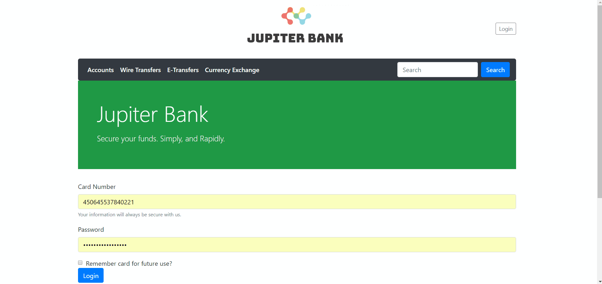

<h1 align="center">
  Bank Project
</h1>


<p align="center">
  <a href="#introduction--insallation">Introduction & Installation</a> •
  <a href="#structure--use">Structure & Use</a> •
  <a href="#download">Gallery</a> •
  <a href="#credits">Notes</a> •
  <a href="#related">Related</a> •
  <a href="#license">License</a> •
  <a href="#acknowledgements">Acknowledgements</a> •
</p>


This project is an implementation of the Django MVC framework to develop a publicly accessible banking website. Users can register and login to their accounts, view their various accounts, request transfers and setup bill payments. The website is supported by Bootstrap 4 with some details customized in terms of style and scripts. The majority of scripts are documented under the [PEP 8](https://www.python.org/dev/peps/pep-0008/) styling convention.



## Introduction & Insallation

These project uses the [Django 2.0](https://www.djangoproject.com/) Framework to implement the project. To install Django 2.0, you can use several package managers:

### pip
```
  pip install Django==2.0.5
```
### Anaconda
```
  conda install -c anaconda django
```
### git 
```
  git clone https://github.com/django.git
```

This project uses anaconda 4.5.9 with Python 3.6.3

## Structure & Use

Once all the files contained in the repo are installed onto your system, simply go into the command line and type 

```
python manage.py runserver 8080
```

When you type in ```http://127.0.0.1:8080``` from your local host, the user will be greeted by the login screen. Using ```urls.py``` in both the top level project folder, and the publicbanking app, it is possible to request pages that seem to follow through without any confusion to the system or the user. Of ocurse, in deployment mode, the website domain will replace the localhost URL. 

### User Authentication

Throughout each step of the application, it is vital to keep track of users and their activity. Currently the application always checks that, each time a particular page is loaded, the user is indeed who they say they are and that they are not trying to impersonate another user in order to access their accounts or transfer money. For example:

```python
    ## Redirect the user if they are not logged in
    if not request.user.is_authenticated:
        return redirect("/publicbanking/")
    ## Redirect the user if they are trying to access another user's account
    if request.user.username != str(Account.objects.get(account_number=num).account_card):
        return redirect("/publicbanking/")
```

Since the request object handles the logged in status on behalf of the developer, these 2 conditional statements ensure that the user is not attempting to pass as another legitimate user. 

### Models

In ```models.py```, we can see that several models are defined and sued within the application:
* **Client** - Represents a physical person who is registered as a bank's client
* **Account** - Represents a bank account that is owned by a client. It is linked to a card number and account type
* **AccountType** - Stores the different bank account types available to Clients
* **BufferAccount** - Represents an account owned by the bank, with the purpose of processing outgoing and incoming transactions
* **Transaction** - Object that represents an amount of money transferred from one account to another
* **WireTransaction** - Object that represents an amount of money transferred from one account to an external account

**Note**: A wire transfer requires different information than a simple transaction, such as institution number and recipient's address, thus the need for a separate model

## Operation

**Login**: When a POST request is sent from the home page or the login modal, int is handled by ```publicbanking/view.py``` function login_user(request) function. By using Django's built-in authenticate() function and other statements for validation, it either recognizes the user as logged in and redirects them to their accounts overview page, or redirects them back to the login page.
**Logout**: When a user submits a POST request to logout, it calls the logout(request) function and redirects user to the login page.
**Transfer Request**: Logged in users can submit transfer requests between their accounts. It ensures that no transfers take place if there are insuficcient funds, and creates a transaction objects with record-keeping variables such as the running balance of each account
**Currency Exchange Information**: Logged in users can enter any amount from any of their bank accounts, and select a currency that they wish to convert this amount into. That displays


## Gallery

This section includes animations that show the website in operation, including several important actions usch as requesting transfers, viewing accounts, and checking user authentication. 

### Login 


### User Authentication Redirect


### Transfer Request


### Currency Exchange

## Notes

### Testing

It is important to test each of the website's components in order to ensure that no errors or unexpected behaviours arise. This can make user experience frustrating and confusing, as well as allow people to potentially hack into sensitive parts of the system and tinker with their inner workings. An effective way of testing such behaviours with this website would be to use a testing suite, [Selenium](https://www.seleniumhq.org/) being a very good contender. 

In this project, Selenium is installed with Anaconda:
```
conda install selenium 
```

### Currency Exchange Information


## Related

## License

This project is licensed under the MIT License - see the [LICENSE.md](LICENSE.md) file for details

## Acknowledgments

